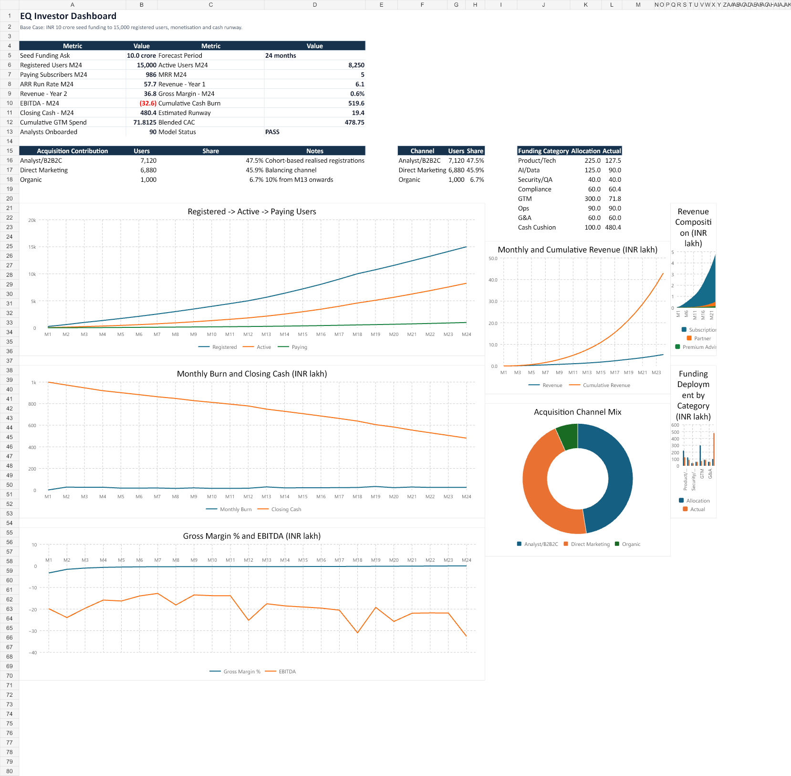
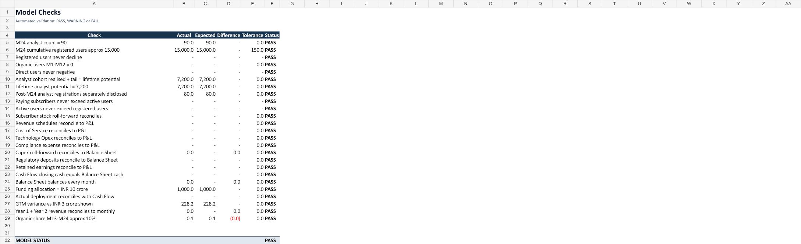
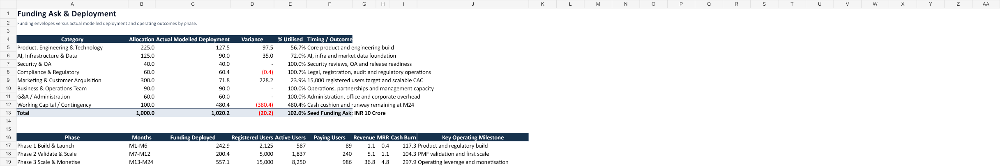
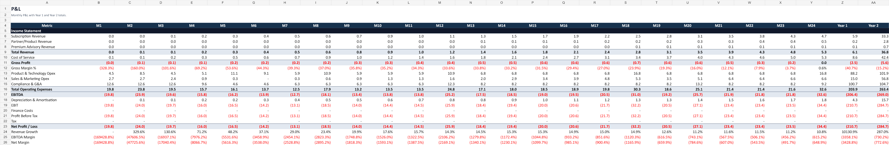
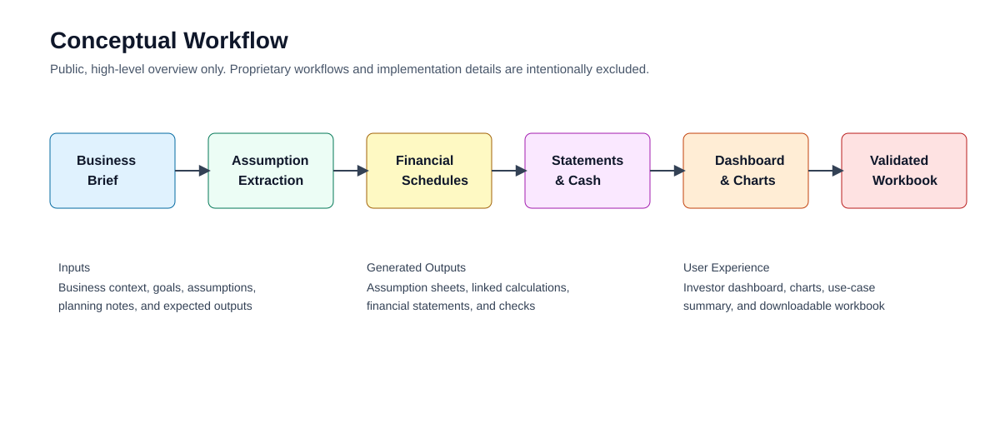

# Finance Model Studio Capability Showcase

## Overview

This repository is a public project showcase for a new NebulaCloud Studio capability: generating investor-ready financial models from business briefs, planning assumptions, and fundraising narratives.

The showcase demonstrates how Studio can transform a detailed seed-stage company brief into a polished, formula-driven Excel workbook with operating schedules, revenue logic, cost modelling, financial statements, funding deployment analysis, investor dashboard, charts, and automated validation checks.

> **Notice**
>
> This repository is a public project showcase created using NebulaCloud Studio.
> The proprietary source code, implementation details, prompts, workflows, datasets, infrastructure, and deployment configuration are intentionally not included.

## Business Problem

CFOs, founders, finance teams, analysts, and investors often need high-quality financial models quickly, but the work is time-consuming and detail-sensitive.

Common pain points include:

- Turning a narrative business plan into auditable assumptions
- Building monthly acquisition, revenue, cost, cash, and balance sheet schedules
- Avoiding broken links, circular formulas, and hidden hardcodes
- Producing investor-ready dashboards and charts
- Reconciling cash flow, P&L, balance sheet, and funding deployment
- Making assumptions editable without breaking downstream outputs
- Creating validation checks that make the model trustworthy

For early-stage companies, this matters even more. A seed-stage founder may have a compelling business story, but investors still expect a credible view of burn, runway, unit economics, GTM efficiency, revenue ramp, margin progression, and capital deployment.

## Solution Overview

NebulaCloud Studio can generate a structured financial model from a user-provided brief and deliver a working Excel workbook.

This showcase example converts a seed-stage fintech planning brief into a 24-month integrated Base Case model covering:

- Editable assumptions
- User acquisition targets
- Analyst/B2B2C acquisition cohorts
- Direct and organic acquisition
- CAC and GTM spend
- Registered, active, and paying user funnels
- Subscription, partner, and advisory revenue
- Cost of service and gross margin
- Technology and product investment
- Compliance and regulatory spend
- Cash flow and runway
- P&L
- Balance sheet
- Funding ask and deployment
- Automated model checks
- Investor dashboard and charts

The result is a decision-ready workbook designed for fundraising discussions, board planning, internal finance reviews, and investor analysis.

## Live Demo

Live demo page:

https://studio-public-demos.github.io/showcase/finance-model-studio-capability/

Narrated product demo:

https://studio-public-demos.github.io/showcase/finance-model-studio-capability/demo.html

Recommended demo treatment:

- Show screenshots of the generated workbook
- Offer a downloadable sample output workbook
- Lead with the narrated product demo video
- Use only sample or synthetic planning data
- Keep source code, prompts, workflows, and implementation files private

## Demo Video

Watch or download the polished narrated product demonstration:

- Demo page: https://studio-public-demos.github.io/showcase/finance-model-studio-capability/demo.html
- MP4: https://studio-public-demos.github.io/showcase/finance-model-studio-capability/assets/demo-video/finance-model-studio-demo.mp4
- Local asset: `assets/demo-video/finance-model-studio-demo.mp4`

The video uses AWS Polly Indian English female voice `Kajal` and presents the capability as a presales-style Solution Architect walkthrough.

Video structure:

1. Start with the business question: "Can Studio turn a fundraising brief into an investor-ready model?"
2. Show the generated Investor Dashboard
3. Show the Assumptions sheet with editable inputs and `MODEL DEFAULT - VERIFY` markers
4. Show acquisition, revenue, cost, cash flow, P&L, and balance sheet schedules
5. Show the Model Checks tab passing validation
6. End with the CTA: "Bring your brief. Studio turns it into a working financial model."

## Project Screenshots

### Investor Dashboard



### Model Checks



### Funding Ask & Deployment



### P&L



## Generated Outputs

Sample generated workbook:

[Download the 24-month integrated financial model](assets/outputs/EQ_24_Month_Integrated_Financial_Model_Base_Case.xlsx)

The workbook includes linked formulas, editable assumptions, dashboard charts, financial statements, and automated checks. It is provided as a representative sample output, not as source code or a reusable implementation template.

## Key Features

- Brief-to-workbook financial model generation
- Assumption-driven model architecture
- Monthly forecast periods across 24 months
- Acquisition funnel and cohort logic
- CAC, GTM spend, and channel contribution analysis
- Revenue modelling by stream
- Cost of service and gross margin modelling
- Technology investment and capitalization treatment
- Compliance and regulatory cash/P&L classification
- Integrated cash flow and runway calculation
- P&L and balance sheet outputs
- Funding allocation versus actual deployment
- Investor dashboard with charts
- Automated model checks with PASS/WARNING/FAIL status
- Stress-tested assumption changes
- Exported Excel workbook delivery

## Intended Users

This capability is designed for people who need finance-grade outputs from messy or narrative business inputs.

- **CFOs and fractional CFOs** who need investor-ready models, board forecasts, budget packs, and runway planning
- **Startup founders and CEOs** preparing for fundraising, investor updates, or strategic planning
- **Finance and FP&A teams** building budgets, forecasts, management reports, and operating plans
- **Financial analysts** preparing models for diligence, valuation, investment review, or internal decision support
- **Investors and VC teams** evaluating startup economics, capital needs, CAC, burn, runway, and growth assumptions
- **Accelerators and venture studios** helping portfolio companies professionalize financial planning
- **Fundraising advisors and consultants** producing capital plans, pitch-support models, and investor materials
- **Corporate strategy teams** modelling new ventures, product launches, and market-entry plans

## Example Use Cases

### 1. Startup Fundraising Model

Example: A seed-stage fintech founder provides a fundraising brief with target users, CAC assumptions, pricing, compliance costs, and technology spend.

Studio generates a 24-month model showing registered users, active users, paying subscribers, MRR, ARR, revenue, gross margin, EBITDA, burn, runway, and funding deployment.

### 2. Board-Ready Operating Plan

Example: A CFO needs a monthly operating plan for the next board meeting.

Studio creates a workbook with assumptions, hiring and spend schedules, revenue forecast, cash runway, P&L, balance sheet, dashboard, and validation checks.

### 3. FP&A Budget And Forecast

Example: A finance team has department budgets, revenue targets, and hiring assumptions spread across documents.

Studio turns the inputs into a structured forecast workbook with monthly budget logic, variance-ready schedules, and management KPIs.

### 4. Investor Diligence Model

Example: A VC analyst wants to assess whether a startup's growth plan is economically credible.

Studio builds a diligence model covering CAC, conversion, churn, revenue per user, gross margin, burn multiple, cash runway, and funding efficiency.

### 5. SaaS Revenue Model

Example: A SaaS founder provides pricing tiers, trial conversion, churn, expansion assumptions, and sales capacity.

Studio creates a subscriber roll-forward, MRR/ARR forecast, churn schedule, expansion revenue logic, and SaaS KPI dashboard.

### 6. Fintech Or Marketplace Unit Economics

Example: A marketplace operator wants to understand contribution margin by transaction volume.

Studio models GMV, take rate, payment fees, fulfillment cost, customer support, contribution margin, and break-even volume.

### 7. Cash Runway And Burn Analysis

Example: A founder asks whether current cash can support an 18-month plan.

Studio builds opening cash, customer receipts, operating costs, GTM spend, capex, working capital, closing cash, monthly burn, cumulative burn, and runway.

### 8. Capital Allocation Plan

Example: A company raises funding and wants to show investors where the money goes and what milestones it funds.

Studio links funding envelopes to actual modelled deployment across product, GTM, compliance, operations, G&A, and working capital.

### 9. Compliance-Heavy Startup Planning

Example: A regulated fintech, healthtech, or insurtech needs to model legal, compliance, deposits, audits, and operational readiness.

Studio separates cash spend, P&L expense, and balance sheet deposits while tying the schedule into financial statements.

### 10. Strategic New Business Case

Example: A corporate strategy team wants to evaluate a new product or geography.

Studio converts assumptions into a business case with customer ramp, revenue streams, operating costs, investment needs, and management KPIs.

## Technical Highlights

High-level capabilities demonstrated:

- Spreadsheet generation
- Formula-linked financial schedules
- Excel chart generation
- Financial statement integration
- Automated validation checks
- Stress-test-ready assumption design
- Public showcase packaging

No proprietary implementation, prompt chains, internal workflow logic, source code, or runtime architecture are included in this repository.

## Architecture Overview

Conceptual workflow:

```text
Business Brief
    -> Assumption Extraction
    -> Model Structure
    -> Linked Forecast Schedules
    -> Financial Statements
    -> Dashboard and Charts
    -> Automated Checks
    -> Excel Workbook Output
```

See the conceptual diagram:



This diagram is intentionally high-level and does not disclose internal Studio orchestration, prompts, proprietary workflows, or implementation architecture.

## Technical Scope & Limitations

This showcase demonstrates a generated financial model using sample planning assumptions.

Important limitations:

- Outputs depend on the quality and completeness of the source brief
- Any assumptions marked `MODEL DEFAULT - VERIFY` require review by the client or finance owner
- Accounting treatments such as software capitalization, tax, deposits, and revenue recognition should be validated by qualified advisors
- The workbook is not investment, legal, tax, accounting, or regulatory advice
- The public repository does not include source code, prompts, workflows, or reusable implementation logic

## Performance Summary

Verified sample output:

- 24-month financial model generated
- 11 workbook sheets created
- Investor dashboard included
- Acquisition, revenue, cost, technology, compliance, cash flow, P&L, balance sheet, funding, and checks schedules included
- Formula-error scan completed with no detected `#REF!`, `#VALUE!`, `#DIV/0!`, `#NAME?`, or `#N/A` errors
- Model checks completed with `PASS`
- Key assumptions stress-tested without structural formula errors

## Attribution

See [ATTRIBUTIONS.md](ATTRIBUTIONS.md).

## Built With NebulaCloud Studio

This showcase was created with NebulaCloud Studio.

NebulaCloud Studio helps teams generate business applications, dashboards, documents, models, and decision-support tools from natural-language briefs and structured inputs.

Studio focuses on outcomes: usable artifacts, live demos, generated outputs, and business-ready deliverables.

Learn more:

- https://studio-public-demos.github.io/
- https://github.com/studio-public-demos

## Related Project Showcases

Explore additional public Studio demos:

https://github.com/studio-public-demos

## Call To Action

Are you a CFO, founder, finance team, analyst, investor, accelerator, or advisory firm?

Bring your business brief, fundraising plan, budget, or operating assumptions.

**NebulaCloud Studio can turn it into a working financial model.**

Request a Studio demo:

https://studio-public-demos.github.io/
